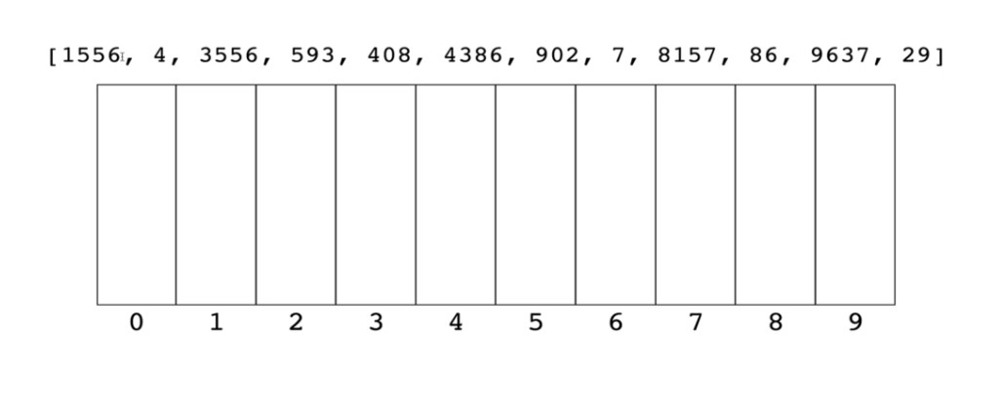
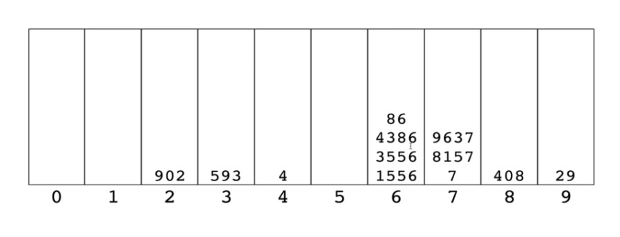

# Radix Sort

## Introduction 

## Comparison Sorts

**Average Time Complexity**
- Bubble Sort - O(n<sup>2</sup>)
- Insertion Sort - O(n<sup>2</sup>)
- Selection Sort - O(n<sup>2</sup>)
- Quick Sort - O(nlog(n))
- Merge Sort - O(nlog(n))
Can we do better? 

Yes, but not by making comparisons

## **Radix Sort** 
Radix sort is a special sorting algorithm that works on lists of numbers

It never makes comparisons between elements!

It exploits the fact that information about the size of a number is encoded in the number of digits

More digits means bigger number!

## How does it work? 



We sort them by the rightmost digit, then put them back into position based on that order. Then we use that new arrangement and go the next digit to the left



We keep going until everything's sorted

---

## Helper Methods

In order to implement radix sort, it's helpful to build a few helper functions first

getDigit(num, place)- returns the digit in *num* at the given *place* value

```js
getDigit(123245, 0) // 5
getDigit(123245, 1) // 4
getDigit(123245, 2) // 3
getDigit(123245, 3) // 2
getDigit(123245, 4) // 1
getDigit(123245, 5) // 0
```

One line Solution: 

```js
function getDigit(num, i){
    return Math.floor(Math.abs(num) / Math.pow(10, i)) % 10;
}
```

digitCount(num)- returns the number of digits in *num*

```js
digitCount(1); // 1
digitCount(25); // 2
digitCount(314); // 3
```

Solution: 

```js
function digitCount(num){
    if (num === 0) return 1;
    return Math.floor(Math.log10(Math.abs(num))) + 1; // Math.log10 is asking 10 to the *what* power would be num
}
```

mostDigits(nums)- Given an array of numbers, returns the number of digits in the largest numbers in the list

```js
mostDigits([1234, 56, 7]); // 4
mostDigits([1,1,11111,1]); // 5
mostDigits([12,34,56,78]); // 2
```

Solution: 

```js
function mostDigits(nums){
    let maxDigits = 0;
    for (let i = 0; i <  nums.length; i++){
        maxDigits = Math.max(maxDigits, digitCount(nums[i]))
    }
    return maxDigits;
}
```

---

## Pseudocode


