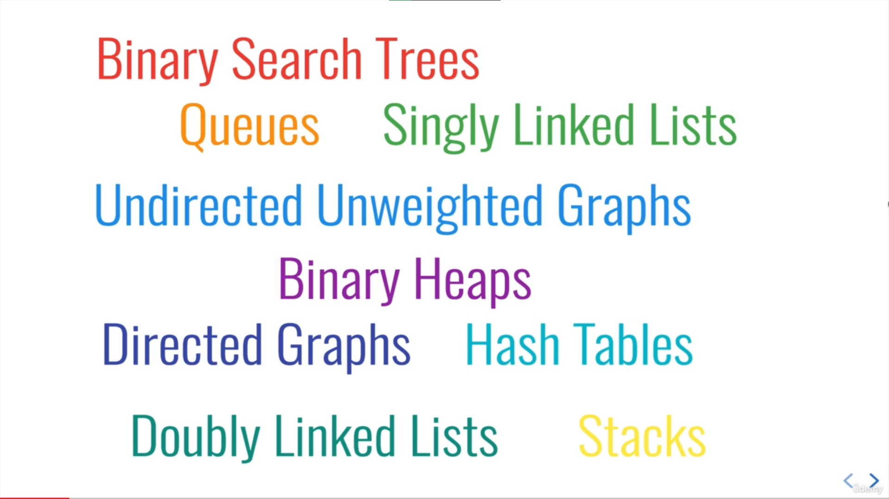

# Intro to Data Structures

## Which Data Structure is the Best?

## What do they do?
Data structures are collections of values, the relationships among them, and the functions or operations that can be applied to the data

## Why so many? 
Different data structures excel at different things. Some are highly specialized, while others (like arrays) are more generally used. 

## Why care?
The more time you spend as a developer, the more likely you'll need to use one of these data structures

We've already worked with many of them unknowingly!

## They all excel in different situations 

> e.g. Working with map/location data? 

Use a **graph**!

> Need an ordered list with fast inserts/removals at the beginning and end?

Use a **linked list**!

> Web scraping nested HTML?

Use a **tree**!

> Need to write a scheduler?

Use a **binary heap**!

---

## ES2015 Class Syntax Overview

