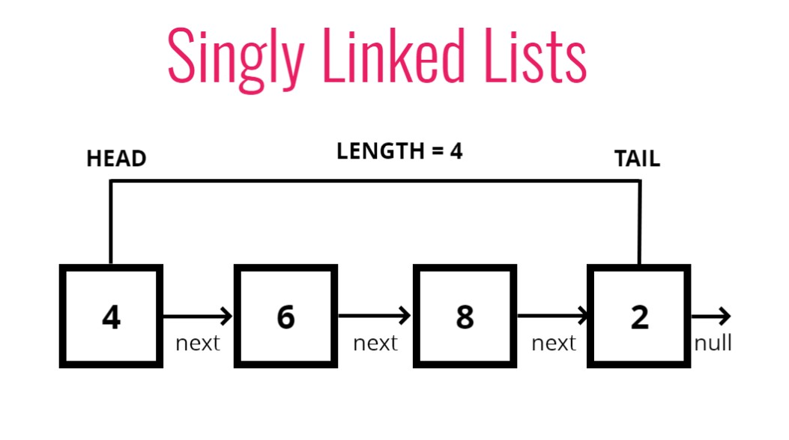

# Singly Linked Lists

## Introduction

## Objectives
- Define what a singly linked list is
- Compare and contrast linked lists with arrays
- Implement insertion, removal and traversal methods on singly linked lists

## What is a **linked list**?
A data structure that contains a **head**, **tail**, and **length** property.

Linked Lists consist of nodes, and each **node** has a **value** and a **pointer** to another node or null

## Singly Linked List



## Comparisons with Arrays

**Lists**
- Do not have indexes
- Connexted via nodes with a **next** pointer
- Random access is not allowed

**Arrays**
- Indexed in order
- Insertion and deletion can be expensive
- Can quickly be accessed at a specific index

---

## Starter Code and Push Intro

```js
// piece of data - val
//reference to next node - next

class Node{
    constructor(val){
        this.val = val;
        this.next = null;
    }
}

class SinglyLinkedList{
    constructor(){
        this.head = null;
        this.tail = null;
        this.length = 0;
    }
    push(val){
        
    }
}

// var first = new Node("Hi")
// first.next = new Node("there")
// first.next.next = new Node("how")
// first.next.next.next = new Node("are")
// first.next.next.next.next = new Node("you")

var list = new SinglyLinkedList()
list.push("HELLO")
list.push("GOODBYE")
```

## Pushing - psuedocode
Adding a new **node** to the end of a linked list

- This function should accept a value
- Create a new node using the value passed to the function
- If there is no head property on the list, set the head and tail to be the newly created node
- Otherwise set the next property on the tail to be new node and set the tail property on the list to be the newly created node
- Increment the length by one
- Return the linked list

**My attempt in index.js** 

---

## Push Solution 

```js
class Node{
    constructor(val){
        this.val = val;
        this.next = null;
    }
}

class SinglyLinkedList{
    constructor(){
        this.head = null;
        this.tail = null;
        this.length = 0;
    }
    push(val){
        var newNode = new Node(val);
        if(!this.head){
            this.head = newNode;
            this.tail = this.head;
        } else {
            this.tail.next = newNode;
            this.tail = newNode;
        }
        this.length++;
        return this;
    }
}

var list = new SinglyLinkedList()
// list.push("HELLO")
// list.push("GOODBYE")
```

---

## Pop Intro