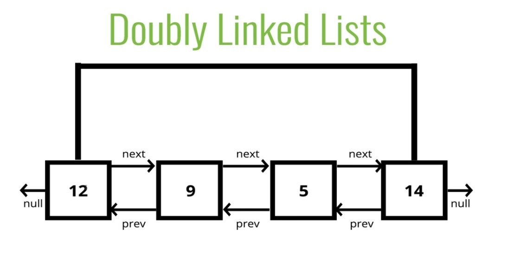

# Doubly Linked Lists

## Introduction

## Objectives
- Construct a doubly linked list
- Compare and contrast doubly and singly linked lists
- Implement basic operations on a doubly linked list

**Almost** identical to singly linked lists, except every node has another **pointer**, to the **previous** node!



## Comparisons with Singly Linked Lists
More memory === More Flexibility 

---

## Setting up our Node Class

### Node has:
- val
- next
- prev (**new**)

### DoublyLinkedList has (unchanged):
- head
- tail
- length


```js
class Node{
    constructor(val){
        this.val = val;
        this.next = null;
        this.prev = null;
    }
}

class DoublyLinkedList{
    constructor(){
        this.head = null;
        this.tail = null;
        this.length = 0;
    }
}
```

---

## Push
Adding a node to the **end** of the Doubly Linked List

## Pseudocode
- Create a new node with the value passed to the function
- If the head property is null, set the head and tail to be the newly created node
- If not, set the next property on the tail to be that node
- Set the previous property on the newly created node to be the tail
- Set the tail to be the newly created node
- Increment the length
- Return the Doubly Linked List

---

## Push Solution

(my attempts will be in index.js)

```js
class Node{
    constructor(val){
        this.val = val;
        this.next = null;
        this.prev = null;
    }
}


class DoublyLinkedList {
    constructor(){
        this.head = null;
        this.tail = null;
        this.length = 0;
    }
    push(val){
        var newNode = new Node(val);
        if(this.length === 0){
            this.head = newNode;
            this.tail = newNode;
        } else {
            this.tail.next = newNode;
            newNode.prev = this.tail;
            this.tail = newNode;
        }
        this.length++;
        return this;
    }
}
```

---

## Pop
Removing a node from the **end** of the Doubly Linked List

## Pseudocode
- If there is no head, return undefined
- Store the current tail in a variable to return later
- If the length is 1, set the head and tail to be null
- Update the tail to be the previous Node
- Set the newTail's next to null
- Decrement the length
- Return the value removed

---

## Pop Solution

```js
class Node{
    constructor(val){
        this.val = val;
        this.next = null;
        this.prev = null;
    }
}


class DoublyLinkedList {
    constructor(){
        this.head = null;
        this.tail = null;
        this.length = 0;
    }
    push(val){
        var newNode = new Node(val);
        if(this.length === 0){
            this.head = newNode;
            this.tail = newNode;
        } else {
            this.tail.next = newNode;
            newNode.prev = this.tail;
            this.tail = newNode;
        }
        this.length++;
        return this;
    } 
    pop(){
        if(!this.head) return undefined;
        var poppedNode = this.tail;
        if(this.length === 1){
            this.head = null;
            this.tail = null;
        } else {
            this.tail = poppedNode.prev;
            this.tail.next = null;
            poppedNode.prev = null;
        }
        this.length--;
        return poppedNode;
    }
}
```

---

## Shift
Removing a node the **beginning** of the Doubly Linked List

## Pseudocode
- If the length is 0, return undefined
- Store the current head property in a variable (we'll need to return it at the end)
- If the length is one
    - Set the head to null
    - Set the tail to null
- Update the head to be the next of the old head
- Set the head's prev property to null
- Set the old head's next to null
- Decrement the length
- Return old head

---

## Shift Solution

```js
class Node{
    constructor(val){
        this.val = val;
        this.next = null;
        this.prev = null;
    }
}


class DoublyLinkedList {
    constructor(){
        this.head = null;
        this.tail = null;
        this.length = 0;
    }
    push(val){
        var newNode = new Node(val);
        if(this.length === 0){
            this.head = newNode;
            this.tail = newNode;
        } else {
            this.tail.next = newNode;
            newNode.prev = this.tail;
            this.tail = newNode;
        }
        this.length++;
        return this;
    } 
    pop(){
        if(!this.head) return undefined;
        var poppedNode = this.tail;
        if(this.length === 1){
            this.head = null;
            this.tail = null;
        } else {
            this.tail = poppedNode.prev;
            this.tail.next = null;
            poppedNode.prev = null;
        }
        this.length--;
        return poppedNode;
    }
    shift(){
        if(this.length === 0) return undefined;
        var oldHead = this.head;
        if(this.length === 1){
            this.head = null;
            this.tail = null;
        }else{
            this.head = oldHead.next;
            this.head.prev = null;
            oldHead.next = null;
        }
        this.length--;
        return oldHead;
    }
}

var list = new DoublyLinkedList()
list.push("Harry")
list.push("Ron")
list.push("Hermione")
```

---

## Unshift
Adding a node to the beginning of our Doubly Linked List

## Pseudocode
- Create a new node with the value passed to the function
- If the length is 0
    - Set the head to be the new node
    - Set the tail to be the new node
- Otherwise
    - Set the prev property on the head of the list to be the new node
    - Set the next property on the new node to be the head property
    - Update the head to be the new node
- Increment the length
- Return the list