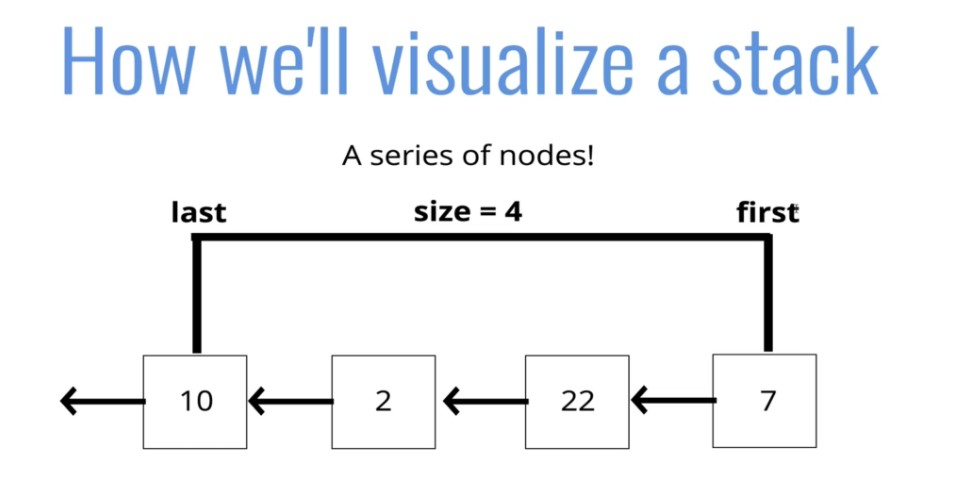

# Stacks

## Introduction

## Objectives
- Define what a stack is
- Understand use cases for a stack
- Implement operations on a stack data structure

## What is a stack?
- A **LIFO** data structure!
- The last element added to the stack will be the first element removed from the stack

## How is it used?
Think about a stack of **plates**, or a stack of anything

As you pile it up the last thing (or the topmost thing) is what gets removed first. 



## Where Stacks are used
- Managing function invocations
- Undo/Redo
- Routing (the history object) is treated like a stack

---

## Creating a Stack with an Array

## Array Implementation 
(JS does not come with its own stack data type)

```js
let stack = [] // let's say this keeps track of our browser history
stack.push("google")
stack.push("instagram")
stack.push("youtube")
stack.pop() // this returns the element most recently added
// this is a stack only if we push and pop from the array
```

---

## Writing Our Own Stack from Scratch

## Push Psuedocode
- The function should accept a value
- Create a new node with that value
- If there are no nodes in the stack, set the first and last property to be the newly created node
- If there is at least one node, create a variable that stores the current first property on the stack
- Reset the first property to be the newly created node
- Set the next property on the node ot be the previously created variable
- Increment the size of the stack by 1

## Pop Psuedocode
- If there are no nodes in the stack, return null
- Create a temporary variable to store the first property on the stack
- If there is only 1 node, set the first and last property to be null
- If there is more than one node, set the first property to be the next property on the current first
- Decrement the size by 1 
- Return the value of the node removed

```js
class Node {
    constructor(value){
        this.value = value;
        this.next = null;
    }
}

class Stack {
    constructor(){
        this.first = null;
        this.last = null;
        this.size = 0;
    }
    push(val){
        var newNode = new Node(val);
        if(!this.first){
            this.first = newNode;
            this.last = newNode;
        } else {
            var temp = this.first;
            this.first = newNode;
            this.first.next = temp;
        }
        return ++this.size;
    }
    pop(){
        if(!this.first) return null;
        var temp = this.first;
        if(this.first === this.last){
            this.last = null;
        }
        this.first = this.first.next;
        this.size--;
        return temp.value;
    }
}
```