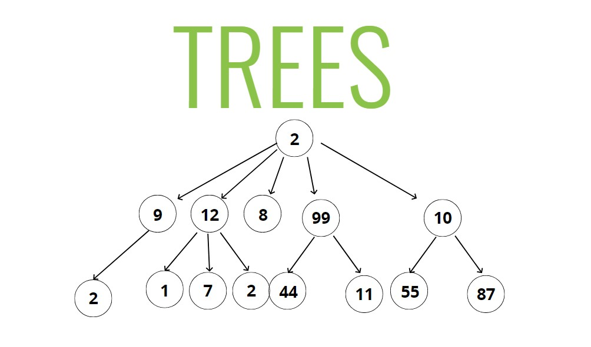
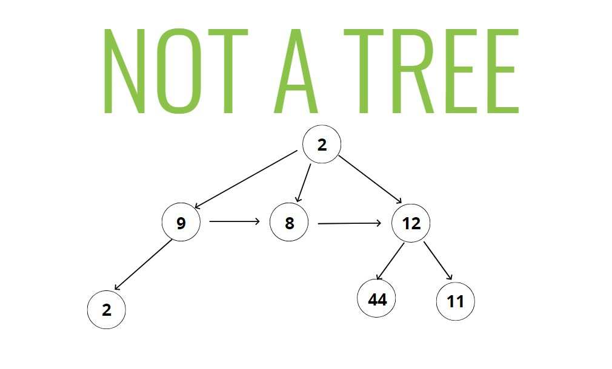
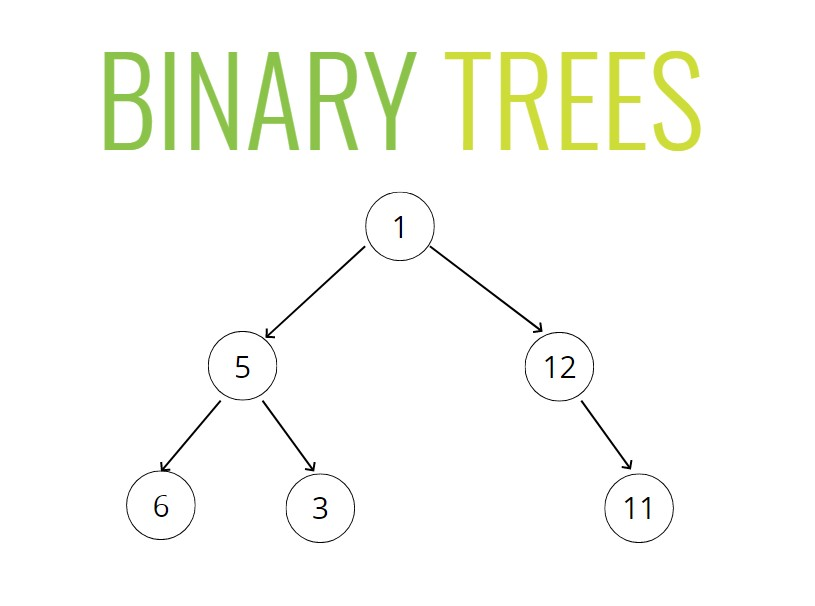
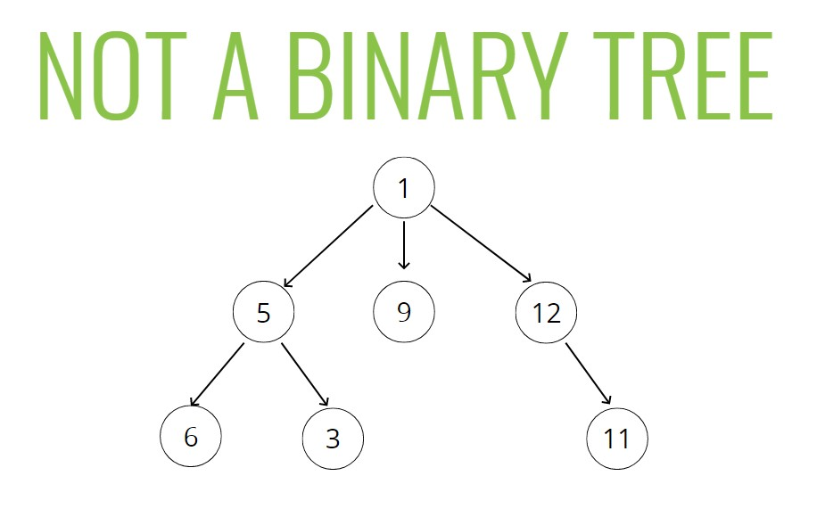
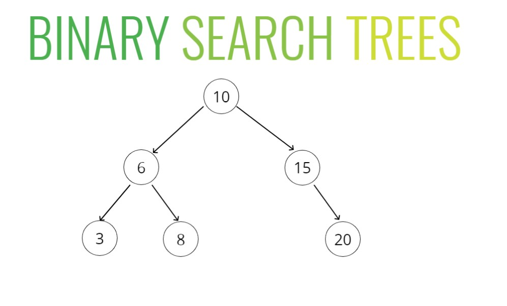

# Binary Search Trees

## Objectives
- Define what a tree is
- Compare and contrast trees and lists
- Explain the differences between trees, binary trees, and binary search trees
- Implement operations on binary search trees

## What is a Tree?
A data structure that consists of nodes in a **parent/child** relationship



(Doesn't have to be number data types, could be anything)

**Lists** - **Linear**

**Trees - Nonlinear**



**This is not a tree because:**
- Nodes are referencing other nodes that aren't their children
- Nodes can't point to "sibling" nodes
- This is a **graph**

## Tree Terminology
- **Root** - The top node in a tree
- **Child** - A node directly connected to another node when moving away from the Root
- **Parent** - The converse notion of a child
- **Siblings** - A group of nodes with the same parent
- **Leaf** - A node with no children
- **Edge** - The connection between one node and another 

---

## Uses for Trees

## Trees
Lots of different applications
- HTML DOM
- Network Routing
- Abstract Syntax Tree 
- Aritificial Intelligence
- Folders in Operating Systems
- Computer File Systems

---

## Intro to Binary Trees

## Kinds of Trees
- Trees
- Binary Trees
- Binary Search Trees



- Only ever has 2 children


- This has 3 children



## How BSTs (Binary Search Trees) Work
- Every parent node has at most **two** children
- Every node to the left of a parent node is **always less** than the parent
- Every node to the right of a parent node is **always greater** than the parent

---

## Searching a Binary Search Tree
The way a binary search tree is structured, it makes it very easy to look things up and insert things

---

## Our Tree Classes

```js
class Node {
    constructor(value){
        this.value = value;
        this.left = null;
        this.right = null;
    }
}

class BinarySearchTree {
    constructor(){
        this.root = null;
    }
}

var tree = new BinarySearchTree();
tree.root = new Node(10);
tree.root.right = new Node(15);
tree.root.left = new Node(7);
tree.root.left.right = new Node(9);
```

---

## BST Insert