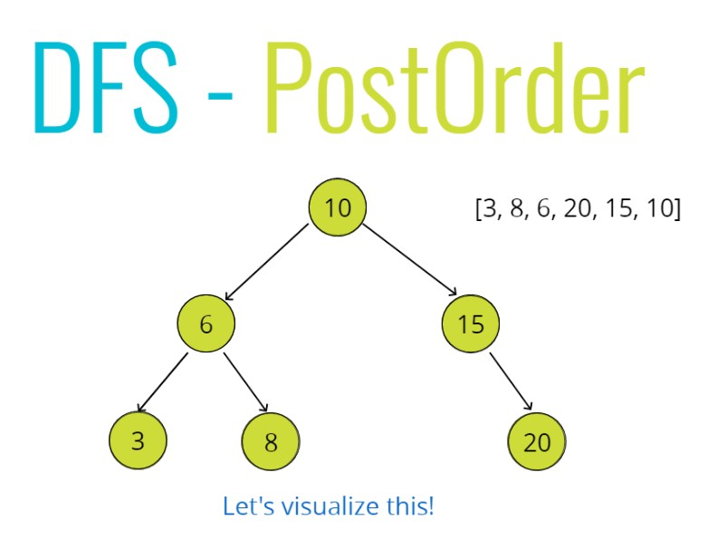

# Tree Traversal

## Traversing a Tree
**Two ways**
- Breadth-first Search
- Depth first Search

## Breadth-first Search


## Depth-first Search (InOrder)


---

## Breadth First Search Intro

<br>


## BFS Psuedocode
**Steps - Iteratively**
- Create a queue (this can be an array) and a variable to store the values of nodes visited
- Place the root node in the queue
- Loop as long as there is anything in the queue
    - Dequeue a node from the queue and push the value of the node into the variable that stores the nodes
    - If there is a left property on the node dequeued - add it to the queue
    - If there is a right property on the node dequeued - add it to the queue
- Return the variable that store the values

---

## Breadth First Search Solution

```js
class Node {
    constructor(value){
        this.value = value;
        this.left = null;
        this.right = null;
    }
}

class BinarySearchTree {
    constructor(){
        this.root = null;
    }
    insert(value){
        var newNode = new Node(value);
        if(this.root === null){
            this.root = newNode;
            return this;
        }
        var current = this.root;
        while(true){
            if(value === current.value) return undefined;
            if(value < current.value){
                if(current.left === null){
                    current.left = newNode;
                    return this;
                }
                current = current.left;
            } else {
                if(current.right === null){
                    current.right = newNode;
                    return this;
                } 
                current = current.right;
            }
        }
    }
    find(value){
        if(this.root === null) return false;
        var current = this.root,
            found = false;
        while(current && !found){
            if(value < current.value){
                current = current.left;
            } else if(value > current.value){
                current = current.right;
            } else {
                found = true;
            }
        }
        if(!found) return undefined;
        return current;
    }
    contains(value){
        if(this.root === null) return false;
        var current = this.root,
            found = false;
        while(current && !found){
            if(value < current.value){
                current = current.left;
            } else if(value > current.value){
                current = current.right;
            } else {
                return true;
            }
        }
        return false;
    }
    BFS(){
        var node = this.root,
            data = [],
            queue = [];
        queue.push(node);

        while(queue.length){
           node = queue.shift();
           data.push(node.value);
           if(node.left) queue.push(node.left);
           if(node.right) queue.push(node.right);
        }
        return data;
    }
}


var tree = new BinarySearchTree();
tree.insert(10);
tree.insert(6);
tree.insert(15);
tree.insert(3);
tree.insert(8);
tree.insert(20);
tree.BFS();
```

---

## Depth First PreOrder Intro

## DFS - PreOrder
**Steps - Recursively**
- Create a variable to store the values of nodes visited
- Store the root of the BST in a variable called current
- Write a helper function which accepts a node
    - Push the value of the node to the variable that stores the values
    - If the node has a left property, call the helper function with the left property on the node
    - If the node has a right property, call the helper function with the right property on the node
- Invoke the helper function with the current variable
- Return the array of values

---

## Depth First PreOrder Solution

```js
    DFSPreOrder(){
        var data = [];
        function traverse(node){
            data.push(node.value);
            if(node.left) traverse(node.left);
            if(node.right) traverse(node.right);
        }
        traverse(this.root);
        return data;
    }
```

---

## Depth First PostOrder Intro




## DFS - PostOrder Pseudocode
**Steps - Recursively**
- Create a variabel to store the values of nodes visited
- Store the root of the BST in a variable called current 
- Write a helper function which accepts a node
    - If the node has a left property, call the helper function with the left property on the node
    - If the node has a right property, call the helper function with the right property on the node
    - Push the value of the node to the variable that stores the values
    - Invoke the helper function with the current variable
- Return the array of values

---

## Depth First PostOrder Solution

```js
    DFSPostOrder(){
        var data = [];
        function traverse(node){
            if(node.left) traverse(node.left);
            if(node.right) traverse(node.right);
            data.push(node.value);
        }
        traverse(this.root);
        return data;
    }
```

---

## Depth First InOrder Intro


## DFS - InOrder
- Create a variable to store the values of nodes visited
- Store the root of the BST in a variable called current
- Write a helper function which accepts a node
    - If the node has a left property, call the helper function with the left propertyon the node
    - Push the value of the node to the variable that stores the values
    - If the node has a right property, call the helper function with the right property on the node
- Invoke the helper function with the current variable

---

## Depth First InOrder Solution

```js
    DFSInOrder(){
        var data = [];
        function traverse(node){
            if(node.left) traverse(node.left);
            data.push(node.value);
            if(node.right) traverse(node.right);
        }
        traverse(this.root);
        return data;
    }
```